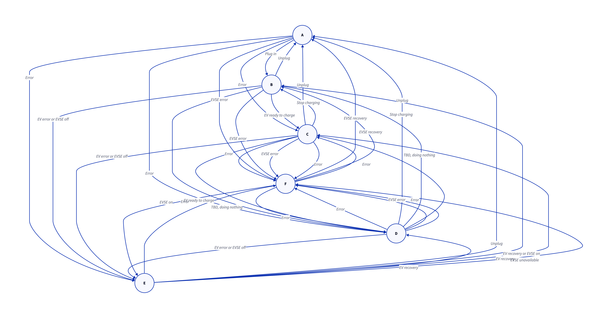
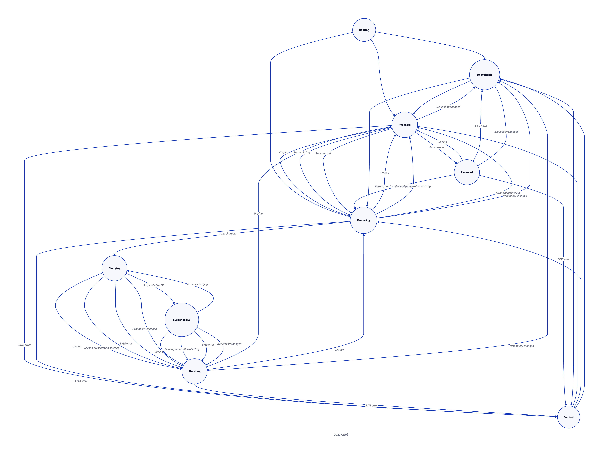
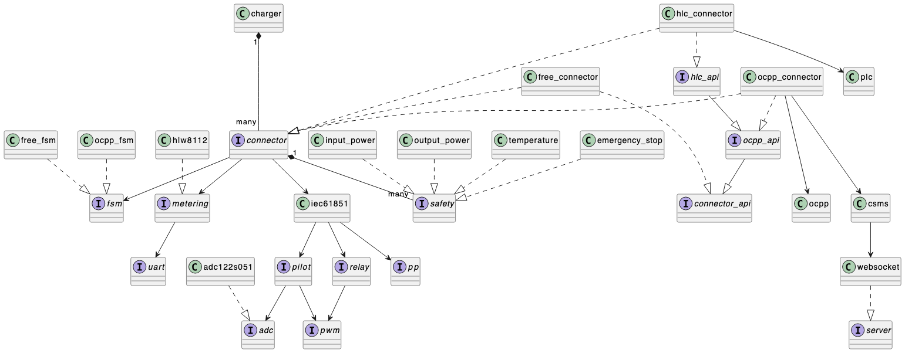

# Charger

## 충전 방식

인증 방식에 따라 세가지 충전 방식을 지원함

| 모듈명 | 인증 방식 | 설명 |
| ------ | --------- | ---- |
| ocpp   | Backend Authentication Method | OCPP를 활용하여 충전기와 백엔드 서버 간 인증 및 결제를 처리 |
| hlc    | Automatic Authentication Method | 차량과 충전기가 ISO 15118 기반으로 자동 인증 및 결제를 수행 |
| free   | Non-Authenticated Method | 별도의 인증 없이 충전기와 차량 연결 시 충전이 시작됨 |

### Non-Authenticated Method 비인증 방식
- 별도의 인증 없이 충전기와 차량 연결 시 충전이 시작됨

#### State Transition Diagram

#### State Transition Table

| Current | Event                  | Next | Note                                |
| ------- | ---------------------- | ---- | ----------------------------------- |
| A       | Plug in                | B    |                                     |
| A       | -                      | C    | Error, go F                         |
| A       | -                      | D    | Error, go F                         |
| A       | -                      | E    | Error, go F                         |
| A       | EVSE error             | F    |                                     |
| B       | Unplug                 | A    |                                     |
| B       | EV ready to charge     | C    |                                     |
| B       | -                      | D    | TBD. Like B to C                    |
| B       | EV error or EVSE off   | E    | e.g diode fault or no power to EVSE |
| B       | EVSE error             | F    |                                     |
| C       | Unplug                 | A    |                                     |
| C       | Stop charging          | B    | can be resumed                      |
| C       | -                      | D    | TBD. Do nothing                     |
| C       | EV error or EVSE off   | E    |                                     |
| C       | EVSE error             | F    |                                     |
| D       | -                      | A    | TBD. Like C to A                    |
| D       | -                      | B    | TBD. Like C to B                    |
| D       | -                      | C    | TBD. Do nothing                     |
| D       | -                      | E    | TBD. Like C to E                    |
| D       | -                      | F    | TBD. Like C to F                    |
| E       | Unplug                 | A    |                                     |
| E       | EV recovery or EVSE on | B    |                                     |
| E       | EV recovery            | C    |                                     |
| E       | -                      | D    | TBD. Like E to C                    |
| E       | EVSE unavailable       | F    |                                     |
| F       | EVSE recovery          | A    |                                     |
| F       | EVSE recovery          | B    |                                     |
| F       | -                      | C    |                                     |
| F       | -                      | D    |                                     |
| F       | EVSE on                | E    |                                     |

#### 커넥터가 여러개인 경우
- 우선순위가 가장 높은 커넥터만 충전이 시작됨
- 우선순위가 동일한 경우, 전력을 1/n씩 나눠가짐
- 충전 중에 높은 우선순위 커넥터가 연결되면, 낮은 우선순위 커넥터는 충전이 중지됨
- config.h: `CONFIG_CHARGER_CONNECTOR_MAX`로 커넥터 수를 설정할 수 있음
- ocpp_checkpoint.h: `OCPP_CONNECTOR_MAX`로 커넥터 수를 설정할 수 있음

### Backend Authentication Method 백엔드 인증 방식

- Unavailable 상태에서 Reserved 상태로 전환 가능성이 사양에 빠져있음
- Preparing 상태에서 Finishing 상태로 전환은 Preparing 상태를 유지하는 방향으로 변경
- MinimumStatusDuration에 따라 상태 메시지 드랍하기

#### State Transition Table

| Current       | Event                    | Next          | Note              |
| ------------- | ------------------------ | ------------- | ------------------|
| Available     | Plug in                  | Preparing     | |
| Available     | Present idTag            | Preparing     | |
| Available     | Remote start             | Preparing     | |
| Available     | Reserve now              | Reserved      | |
| Available     | Availability change      | Unavailable   | |
| Available     | EVSE error               | Faulted       | |
| Preparing     | Unplug                   | Available     | |
| Preparing     | Present idTag again      | Available     | |
| Preparing     | Connection timeout       | Available     | |
| Preparing     | Start charging           | Charging      | |
| Preparing     | Smart charging           | SuspendedEVSE | |
| Preparing     | No idTag within timeout  | Finishing     | |
| Preparing     | Availability changed     | Unavailable   | |
| Preparing     | EVSE error               | Faulted       | |
| Charging      | Unplug                   | Available     | |
| Charging      | Suspended by EV          | SuspendedEV   | |
| Charging      | Smart charging           | SuspendedEVSE | invalidated in StartTransaction.conf |
| Charging      | Stop charging            | Finishing     | |
| Charging      | Availability changed     | Unavailable   | can be scheduled |
| Charging      | EVSE error               | Faulted       | |
| SuspendedEV   | Unplug                   | Available     | |
| SuspendedEV   | Resume charging          | Charging      | |
| SuspendedEV   | Smart charging           | SuspendedEVSE | |
| SuspendedEV   | Stop charging            | Finishing     | |
| SuspendedEV   | Availability changed     | Unavailable   | |
| SuspendedEV   | EVSE error               | Faulted       | |
| SuspendedEVSE | Unplug                   | Available     | |
| SuspendedEVSE | EVSE restriction lifted  | Charging      | |
| SuspendedEVSE | Stop charging            | Finishing     | |
| SuspendedEVSE | Availability changed     | Unavailable   | |
| SuspendedEVSE | EVSE error               | Faulted       | |
| Finishing     | Unplug                   | Available     | |
| Finishing     | Restart                  | Preparing     | |
| Finishing     | Availability changed     | Unavailable   | |
| Finishing     | EVSE error               | Faulted       | |
| Reserved      | Unplug                   | Available     | |
| Reserved      | Reservation ID presented | Preparing     | |
| Reserved      | Scheduled                | Unavailable   | |
| Reserved      | Availability changed     | Unavailable   | |
| Reserved      | EVSE error               | Faulted       | |
| Unavailable   |                          | Available     | |
| Unavailable   |                          | Preparing     | |
| Unavailable   |                          | SuspendedEVSE | |
| Unavailable   |                          | Faulted       | |
| Faulted       |                          | Available     | |
| Faulted       |                          | Preparing     | |
| Faulted       |                          | SuspendedEVSE | |
| Faulted       |                          | Unavailable   | |

## 내부 구조

### Charger Class Diagram

## 노트
- connected면 occupied 임
- occupied 라도 connected가 아닐 수 있음
  - remote start 같은 경우
- occupied나 connected 상태더라도 충전은 시작되지 않음
  - 인증과 같은 추가 프로세스가 필요할 수 있기 때문
- session started
  - 충전은 시작안했을 수도 있음. 사용자 인증등 충전에 필요한 프로세스는 완료됨
  - 이 상태 이전에는 충전이 시작될 수 없음
- charging started
  - 릴레이가 붙어 실제로 충전이 시작됨
  - 차량에서 실제로 전력을 끌어가지 않을 수도 있음
- charging stopped
  - 릴레이가 떨어짐. 충전 안함
  - 충전 종료가 아닐 수 있음
  - session started 상태라면 다시 충전할 수 있음
- 릴레이 붙이기 전에 low side of pwm-signal 전압 확인해야 함. -12V(-11V ~ -13V)이어야 함
