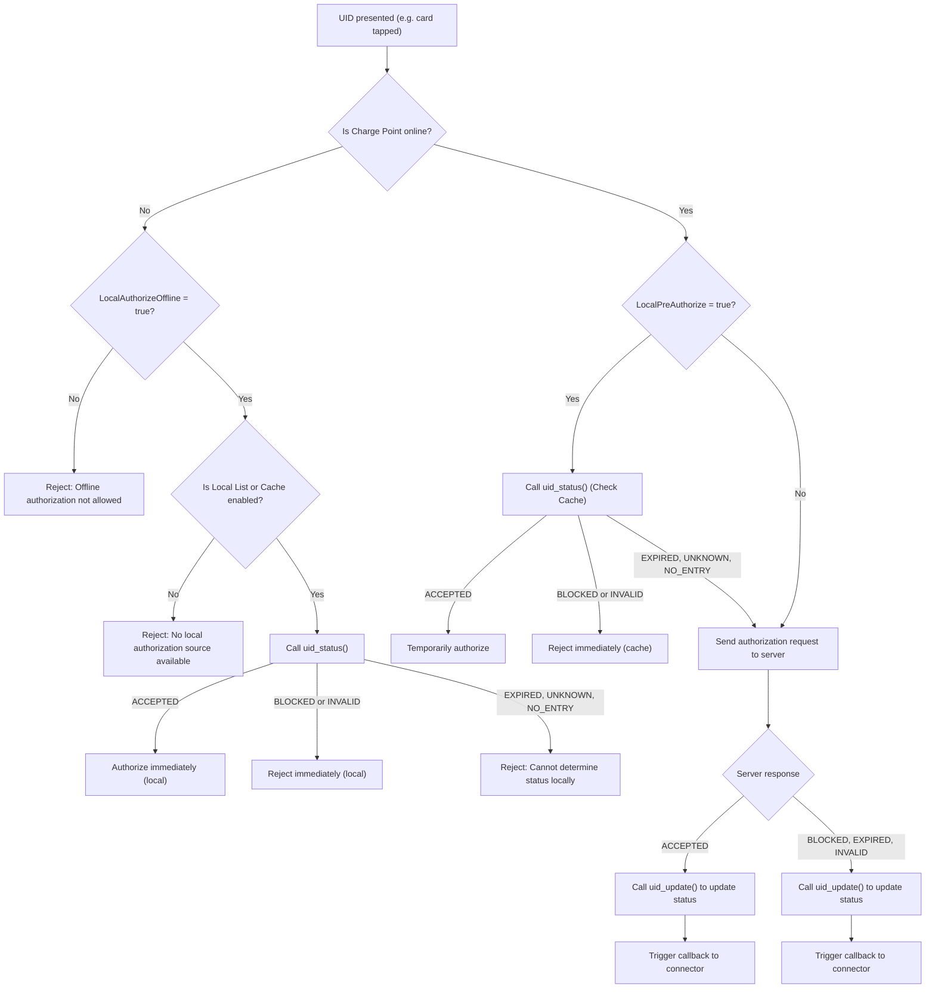

[한국어](#ocpp-인증-처리-로직-요약-korean-version)

# OCPP Authorization Logic Summary

This document describes how Charge Points handle authorization in OCPP systems, focusing on key configuration flags that affect offline and online authentication behavior.  
Only the 4 most relevant parameters are covered. BootNotification and provisioning logic are out of scope.

## Key Configuration Parameters

| Key | Description |
|------|-------------|
| `LocalAuthorizeOffline` | Whether local authorization is allowed while offline |
| `LocalAuthListEnabled` | Whether to enable Local Authorization List |
| `AuthorizationCacheEnabled` | Whether to store and reuse idTag status from the central system |
| `LocalPreAuthorize` | Whether to authorize immediately from cache while online, before server response |

## Authorization Source Priority

When multiple sources are available, authorization follows this precedence:

`Local Authorization List > Authorization Cache > Central System`

- If a UID is found in the Local Authorization List, it is always used first.
- Such UIDs must never be saved in the Authorization Cache.

## Authorization Flowchart



### 1. Offline Authorization Conditions

| Condition | Behavior |
|-----------|----------|
| `LocalAuthorizeOffline = false` | ❌ Offline auth not allowed. Always rejected. |
| `LocalAuthorizeOffline = true` + List = false + Cache = false | ❌ No local sources. Rejected. |
| `LocalAuthorizeOffline = true` + List = true + Cache = false | ✅ Authorize using List only |
| `LocalAuthorizeOffline = true` + List = false + Cache = true | ✅ Authorize using Cache only |
| `LocalAuthorizeOffline = true` + List = true + Cache = true | ✅ Prefer List, fallback to Cache |

### 2. Online Authorization Conditions

| Config | Behavior |
|--------|----------|
| `LocalPreAuthorize = false` | Always request from Central System and wait for response |
| `LocalPreAuthorize = true` | Use cache if status is `Accepted`, then follow up with server response |

> `LocalPreAuthorize` is a setting that only applies when the Charge Point is online, allowing the system to authorize users more quickly by consulting the local cache before waiting for a server response.

## Authorization Behavior Matrix

| Network | LocalAuthorizeOffline | LocalAuthListEnabled | AuthorizationCacheEnabled | Behavior |
|----------|------------------------|------------------------|------------------------------|----------|
| Offline | false | - | - | ❌ Auth rejected |
| Offline | true | false | false | ❌ No local source |
| Offline | true | true | false | ✅ Use List |
| Offline | true | false | true | ✅ Use Cache |
| Offline | true | true | true | ✅ Prefer List, fallback to Cache |
| Online  | - | - | - | 🔁 Behavior depends on `LocalPreAuthorize` |

## Advanced Behavior and Constraints

This section documents implementation-specific constraints and behavioral rules
as per the OCPP specification and commonly accepted practices.

### 1. Authorization Cache Update Conditions

- The cache is updated when `idTagInfo` is received from:
  - `Authorize.conf`
  - `StartTransaction.conf`
  - `StopTransaction.conf`

This ensures the cache reflects the most recent status (e.g., `Accepted`, `Blocked`, `Expired`) and expiry timestamp for a UID.

### 2. Cache Eviction Policy

- If storage is limited:
  1. Remove invalid entries (`Expired`, `Blocked`, `Invalid`)
  2. If still full, remove the oldest entry

This ensures that valid and recently used entries are prioritized.

### 3. Cache is not final authority online

- Any ID not marked `Accepted` must trigger a server request
- Update cache using `uid_update()` based on server response

### 4. Local List vs Server Conflict

- If server response conflicts with local list:
  - Send `StatusNotification.req`
    - `connectorId = 0`
    - `errorCode = LocalListConflict`

### 5. List Size Limit

- Controlled by `LocalAuthListMaxLength`
- New entries must be rejected if at max capacity

### 6. Profile Dependency

- CP must support `LocalAuthListManagement` feature profile to allow remote updates to list

### 7. AllowOfflineTxForUnknownId Behavior

If:
```AllowOfflineTxForUnknownId = true```

Then:
- If UID not found in List or Cache, charging may begin
- When back online, if server responds with status ≠ Accepted:

#### → `StopTransactionOnInvalidId = true`
- Terminate transaction immediately

#### → `StopTransactionOnInvalidId = false`
- Do not stop transaction, but:
  - Stop power delivery
  - Or limit to `MaxEnergyOnInvalidId`

This policy allows operators to support fail-open behavior while retaining safety and usage limits.

## Notes

- UIDs in Local List are never added to the Cache
- The cache is updated with status from the server and used offline
- Expiry/TTL is implementation-defined
- `LocalPreAuthorize` requires care with rejected follow-up responses

## Summary

- `LocalAuthorizeOffline = true` required for offline auth
- Either List or Cache must be active to support it
- Local List always takes priority over Cache
- Online mode can pre-authorize using Cache if `LocalPreAuthorize = true`

# OCPP 인증 처리 로직 요약 (Korean Version)

이 문서는 OCPP 기반 충전기에서 인증 처리에 영향을 미치는 주요 설정값들과,
그 설정 조합에 따른 온라인/오프라인 인증 동작 방식을 설명합니다.  
아래 4가지 핵심 설정 항목에 초점을 맞춥니다.

## 주요 설정 항목

| 설정 키 | 설명 |
|---------|------|
| `LocalAuthorizeOffline` | 충전기가 오프라인 상태에서 로컬 인증을 허용할지 여부 |
| `LocalAuthListEnabled` | Local Authorization List를 활성화할지 여부 |
| `AuthorizationCacheEnabled` | 서버 응답을 Authorization Cache에 저장하고 재사용할지 여부 |
| `LocalPreAuthorize` | 온라인 상태에서도 캐시를 먼저 조회하여 인증을 선처리할지 여부 |

## 인증 우선순위 규칙

충전기가 여러 인증 소스를 동시에 사용할 수 있는 경우, 다음과 같은 우선순위가 적용됩니다:

`Local Authorization List > Authorization Cache > Central System`

- Local Authorization List에 등록된 UID가 있는 경우, 항상 이를 우선 적용합니다.
- 같은 UID가 Local List에 있으면, Authorization Cache에 저장하거나 조회하지 않습니다.

## 인증 처리 플로우

(※ 동일한 Mermaid 흐름도는 영어 버전에 포함되어 있습니다)

### 1. 오프라인 인증 조건

| 조건 | 설명 |
|-------|-------|
| `LocalAuthorizeOffline = false` | ❌ 오프라인 인증 불가. 무조건 거부. |
| `LocalAuthorizeOffline = true` + `List = false` + `Cache = false` | ❌ 인증 불가 (로컬 인증 수단 없음) |
| `LocalAuthorizeOffline = true` + `List = true` + `Cache = false` | ✅ List만 사용하여 인증 |
| `LocalAuthorizeOffline = true` + `List = false` + `Cache = true` | ✅ Cache만 사용하여 인증 |
| `LocalAuthorizeOffline = true` + `List = true` + `Cache = true` | ✅ List 우선, 없으면 Cache 사용 |

> List 또는 Cache 둘 중 하나 이상이 활성화되어야 오프라인 인증 가능

### 2. 온라인 인증 조건

| 설정 | 동작 방식 |
|--------|------------|
| `LocalPreAuthorize = false` | UID 입력 시 서버에 요청 → 응답 기반으로 인증 결정 |
| `LocalPreAuthorize = true` | UID 입력 시 Authorization Cache 먼저 조회 → ACCEPTED인 경우 즉시 인증 진행, 이후 서버 응답 반영 |

## 인증 동작 요약 테이블

| 연결 상태 | LocalAuthorizeOffline | LocalAuthListEnabled | AuthorizationCacheEnabled | 인증 동작 |
|--------------|------------------------|------------------------|------------------------------|--------------|
| **오프라인** | false | - | - | ❌ 인증 불가 |
| **오프라인** | true | false | false | ❌ 인증 불가 (로컬 인증 수단 없음) |
| **오프라인** | true | true | false | ✅ List로 인증 |
| **오프라인** | true | false | true | ✅ Cache로 인증 |
| **오프라인** | true | true | true | ✅ List 우선, 없으면 Cache |
| **온라인** | - | - | - | 🔁 `LocalPreAuthorize` 설정에 따라 처리 |

## 고급 동작 및 구현 제약 사항

### 1. Authorization Cache 업데이트 조건

- Authorization Cache는 다음 메시지에서 `idTagInfo` 객체를 수신할 경우 업데이트됩니다:
  - `Authorize.conf`
  - `StartTransaction.conf`
  - `StopTransaction.conf`

### 2. Authorization Cache 정리 정책

- 저장 공간이 부족할 경우 다음 순서로 엔트리를 제거해야 합니다:
  1. 유효하지 않은 엔트리(`Expired`, `Blocked`, `Invalid`) 우선 삭제
  2. 여전히 부족하면 가장 오래된 엔트리 삭제 (FIFO 또는 LRU)

### 3. 온라인 상태에서 Cache는 최종 판단 기준이 아님

- Cache에서 `Accepted`가 아닌 경우, 반드시 서버에 인증 요청을 전송해야 하며,
- 서버 응답에 따라 Cache를 `uid_update()`로 갱신해야 합니다.

### 4. Local List와 서버 응답 충돌 시

- 동일한 UID에 대해 서버 응답과 Local List가 불일치하면,
- `StatusNotification.req`를 전송해야 합니다:
  - `connectorId = 0`
  - `errorCode = LocalListConflict`

### 5. Local List 최대 크기

- `LocalAuthListMaxLength` 설정에 정의된 최대 개수까지만 저장할 수 있습니다.

### 6. Profile 종속성

- Local List 관리를 위해서는 프로파일에 `LocalAuthListManagement`가 포함되어 있어야 합니다.

### 7. AllowOfflineTxForUnknownId 설정

- `AllowOfflineTxForUnknownId = true`인 경우:
  - List나 Cache에 없는 UID라도 충전을 시작할 수 있습니다.
  - 이후 온라인 상태가 되었을 때 Central System 응답이 `Accepted`가 아닌 경우:

#### → `StopTransactionOnInvalidId = true`
- 충전 세션 즉시 중단 (hard stop)

#### → `StopTransactionOnInvalidId = false`
- 충전은 중단하지 않지만:
  - 전력 공급을 중단하거나 (soft stop),
  - `MaxEnergyOnInvalidId` 설정 값만큼만 전력 공급

## 참고 사항

- Local Authorization List에 등록된 UID는 Cache에 저장되지 않으며, 항상 우선 적용됩니다.
- Authorization Cache는 서버 응답을 저장하고, 오프라인 인증에 재사용됩니다.
- Cache 만료 시간(`expiry`) 또는 TTL은 시스템 정책에 따라 결정됩니다.
- `LocalPreAuthorize = true` 설정 시, 서버 응답이 거부이면 충전 세션 중단을 고려해야 합니다.

## 요약

- `LocalAuthorizeOffline = true`이어야 오프라인 인증이 가능함
- 오프라인 인증 시에는 `List` 또는 `Cache` 중 하나 이상이 활성화되어야 함
- Local List가 항상 우선순위를 가지며, Cache에 중복 저장되지 않음
- 온라인 상태에서는 `LocalPreAuthorize` 설정으로 Cache 선처리 가능
