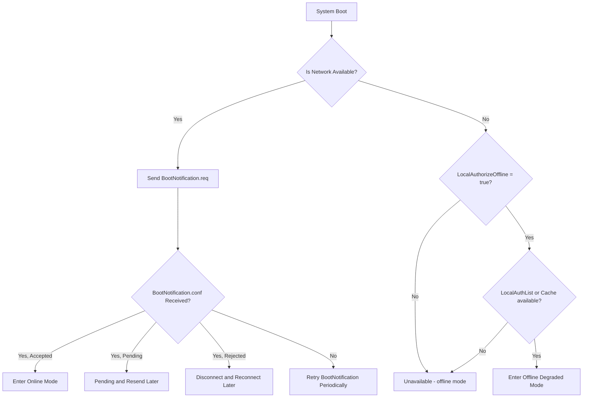

[한국어](#-오프라인-상태에서의-시스템-부팅-처리-전략-ocpp)

# Offline Boot Handling Strategy for Charge Points (OCPP)

This document describes how an OCPP-based Charge Point should behave when it reboots while disconnected from the network, specifically before receiving `BootNotification.conf`.

Although the OCPP specification does not explicitly require `BootNotification.conf` before normal operation, many implementations assume it implicitly. This assumption can severely impact Charge Point **availability** in offline conditions.

## Problem

- When a Charge Point reboots in offline mode, it sends a `BootNotification.req` but cannot receive a response.
- Typical implementations behave as follows until `BootNotification.conf` is received:
  - The Charge Point remains in the `Unavailable` or `Initializing` state.
  - Messages like `Authorize`, `StartTransaction`, and `MeterValues` are ignored or dropped.
- As a result, offline authentication functionality becomes ineffective after a reboot.
- Treating `BootNotification.conf` as a strict requirement creates a fragile design.
- The system must support fallback logic to maintain partial functionality and preserve availability after offline reboot.

## Analysis

- The OCPP spec defines:
  - If `BootNotification.conf.status = Rejected`, the CP must close the connection and retry.
  - If `Pending`, the connection remains open for configuration and may later be upgraded to `Accepted`.
- In this interim, transaction messages may queue up or be lost.
- Ultimately, even with offline authentication enabled, the system becomes inoperable without network access post-boot.

## Recommendations & Fallback Strategy

### 1. Enter "Offline Degraded Mode" if BootNotification fails

- Conditions:
  - `LocalAuthorizeOffline = true`
  - At least one local source available (LocalAuthList or AuthorizationCache)

- Behavior:
  - Maintain `csms_is_up() == false`
  - Allow a limited set of operations (Authorize, StartTransaction)

### 2. On network recovery, resend BootNotification

- Upon reconnection, always resend `BootNotification.req`
- Based on response:
  - `Accepted`: resume full normal mode and flush message queue
  - `Rejected`: disconnect and retry
  - `Pending`: allow partial operation (e.g., configuration updates), optionally send buffered messages
    - If transaction messages are not accepted or fail, treat like `Rejected`

### 3. If Rejected during an ongoing transaction

- Immediately stop transaction (Hard stop)
- Use `StopTransactionOnInvalidId`, `MaxEnergyOnInvalidId` as fallback policies

## Boot Sequence Flowchart (Online/Offline)

---

# 오프라인 상태에서의 시스템 부팅 처리 전략 (OCPP)

이 문서는 OCPP 기반 충전기가 **네트워크 연결이 불가능한 상태에서 재부팅되는 경우**, `BootNotification.conf` 수신 전까지 어떤 방식으로 동작해야 하는지를 다룹니다.

OCPP 명세는 명시적으로 부팅 직후 동작을 강제하진 않지만, 대부분의 구현이 암묵적으로 `BootNotification` 성공 이후 정상 동작을 개시합니다. 오프라인 동작을 고려할 때 이러한 가정은 실무에서 충전기 가용성에 치명적일 수 있습니다.

## 문제

- 충전기가 오프라인 상태에서 재시작된 경우, `BootNotification.req`를 서버로 전송하지만 응답을 수신하지 못함
- OCPP의 전형적 구현에서는 `BootNotification.conf` 수신 전까지:
  - Charge Point 상태가 `Unavailable` 또는 `Initializing` 상태로 유지됨
  - `Authorize`, `StartTransaction`, `MeterValues` 등의 메시지를 전송하지 않거나 무시함
- 따라서 오프라인 인증 기능이 있더라도, 재부팅 이후에는 충전을 **전혀 시작할 수 없는 상황**이 됨
- BootNotification 성공 여부를 절대적인 조건으로 두는 것은 실무에서는 취약한 설계가 될 수 있음
- 오프라인 재부팅 이후에도 충전기 기능이 일정 수준 동작할 수 있도록 fallback 설계를 반드시 포함해야 함

## 분석

- OCPP 명세는 다음과 같이 지시함:
  - `BootNotification.conf.status = Rejected`인 경우, CP는 소켓을 종료하고 재시도
  - `Pending`은 설정 수신을 위한 연결 유지가 가능하며, 이후 `Accepted`로 전환될 수 있음
- 이 상황에서 충전 요청 메시지들이 쌓이거나 손실될 수 있음
- 결과적으로 오프라인 인증 기능이 활성화되어 있더라도, 부팅 이후 네트워크가 없으면 "작동하지 않는 기능"이 됨

## 대안 및 권장 동작

### 1. BootNotification.conf 실패 시 "Offline Degraded Mode"로 전환

- 조건:
  - `LocalAuthorizeOffline = true`
  - 로컬 인증 수단이 존재 (LocalAuthList or AuthorizationCache)

- 동작:
  - `csms_is_up() == false` 상태로 유지하면서도,
  - 제한된 범위에서 Authorize 및 Transaction 허용

### 2. 온라인 복귀 시 BootNotification 재전송

- 네트워크가 복구되면 **반드시** `BootNotification.req`를 재전송
- 이후 흐름:
  - `Accepted` 수신 → 정상 모드 진입, 모든 메시지 큐 전달
  - `Rejected` 수신 → 소켓 종료 후 재시도
  - `Pending` 수신 → 설정 변경 등 일부 메시지 수신 가능, 필요 시 메시지 전송 허용
    - 트랜잭션 관련 메시지 응답이 없거나 오류를 반환할 경우 `Rejected`와 동일하게 처리

### 3. 충전 중 Boot 응답이 `Rejected`일 경우

- 즉시 충전 중단 (Hard stop)
- `StopTransactionOnInvalidId`, `MaxEnergyOnInvalidId` 정책 활용
